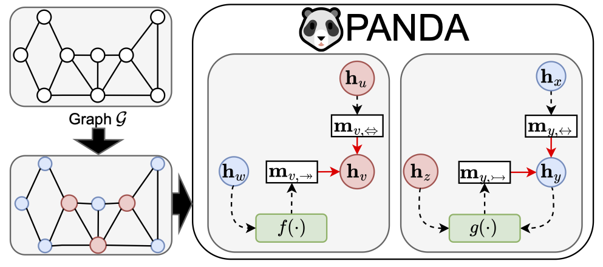

# :panda_face: PANDA: Expanded Width-Aware Message Passing Beyond Rewiring

 
 [](https://arxiv.org/abs/2406.03671) [](https://hits.seeyoufarm.com)

[](https://paperswithcode.com/sota/graph-classification-on-imdb-binary?p=panda-expanded-width-aware-message-passing)
[](https://paperswithcode.com/sota/graph-classification-on-reddit-binary?p=panda-expanded-width-aware-message-passing)

## TL;DR
- **PANDA** is a novel message passing framework that addresses the over-squashing problem in GNNs by selectively expanding node widths without graph rewiring.
- Please see our paper for more details: [PANDA: Expanded Width-Aware Message Passing Beyond Rewiring](https://arxiv.org/abs/2406.03671).

## Introduction


Graph Neural Networks (GNNs) face a critical issue known as "over-squashing," which impedes the propagation of long-range information. While previous studies attempted to solve this through graph rewiring, such approaches risk distorting the original graph structure and information flow. We propose :panda_face: PANDA (exPANDed width-Aware) message passing, a new paradigm that selectively expands the width of high-centrality nodes, enabling them to better process signals from distant nodes. Our experimental results demonstrate that PANDA outperforms existing rewiring methods, suggesting that selectively expanding node hidden states can be an effective alternative for addressing over-squashing.


## Requirements
To set up the environment, run the following command:
```
conda env create -f environment.yml
```

## How to Run

### Graph Classification
Example Command:
```
python run_graph_classification.py --rewiring=panda --dataset={$dataset} --layer_type={$model} --exp_factor={$exp_factor} --centrality={$centrality} --top_k={$top_k} --device={$device}
```

The arguments we consider in our paper:
- `dataset`:
    - `reddit`, `imdb`, `mutag`, `enzymes`, `proteins`, `collab`
- `model`:
    - `PANDA-GCN`, `PANDA-GIN`, `PANDA-RGCN`, `PANDA-RGIN`
- `exp_factor`:
    - [1.25, 1.5, 1.75, 2]
- `centrality`:
    - `degree`, `closeness`, `betweeness`, `pagerank`, `load`
- `top_k`:
    - [1, 3, 5, 7, 10, 15]
- `device`:
    - gpu number

If you want to run 100 tirals, add `num_trials` like below:
```
python run_graph_classification.py --rewiring=panda --dataset={$dataset} --layer_type={$model} --exp_factor={$exp_factor} --centrality={$centrality} --top_k={$top_k} --device={$device} --num_trials=100
```

## Paper
If the code is helpful for your project, please cite our paper:
```
@inproceedings{
choi2024panda,
title={{PANDA}: Expanded Width-Aware Message Passing Beyond Rewiring},
author={Jeongwhan Choi and Sumin Park and Hyowon Wi and Sung-Bae Cho and Noseong Park},
booktitle={Forty-first International Conference on Machine Learning},
year={2024},
url={https://openreview.net/forum?id=J1NIXxiDbu}
}
```

## Star History

[](https://star-history.com/#jeongwhanchoi/PANDA&Date)